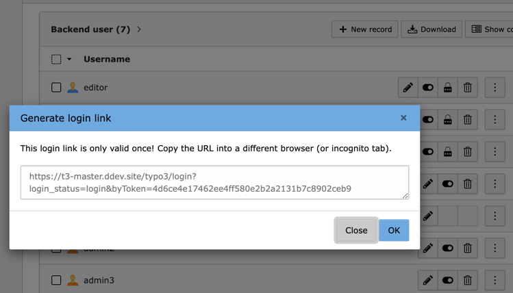
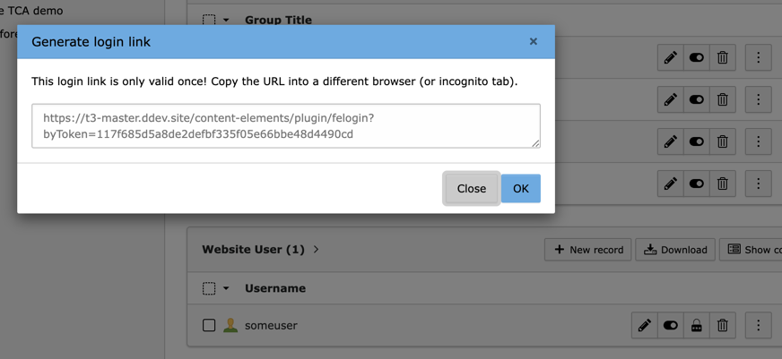

# TYPO3 Extension `login_link`

This extensions makes it possible to login into any BE or FE user by a link generated in the backend.

The following screenshots show the list of backend and frontend users.
After clicking the additional icon with the lock, a modal opens with the login link.




## Pricing

- € 100.00 (ex. VAT) for 1 site
- € 300.00 (ex. VAT) for unlimited sites related to the agency itself or its customers

Included: Bugfix & feature releases

Contact: Please write an email to extension@ringer.it with the version you need and your invoice address + VAT ID.


## Installation

Install this extension via composer by using the following command:

```bash
composer require georgringer/login-link
```

## Usage

### Login links for BE users

The login link can only be generated for non admin users

!! Currently nothing is logged when a user logs in via a login link !!

Disable feature by setting `LOGINLINK_DISABLE_BE=1` in your .env file.

### Login links for FE users

Set the following Page TsConfig to enable the login link for FE users:

```typoscript
# 123 is the page which is used to login users, e.g. the login page
tx_loginlink.fe.loginPage = 123
```

Disable feature by setting `LOGINLINK_DISABLE_FE=1` in your .env file.
